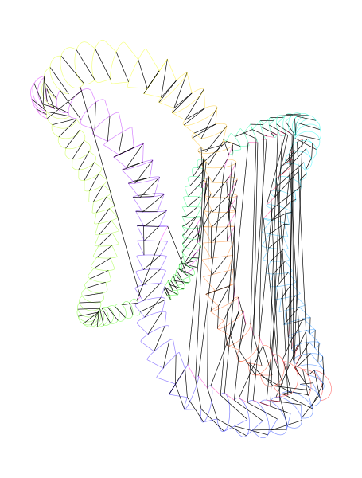
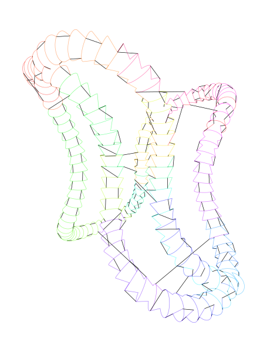
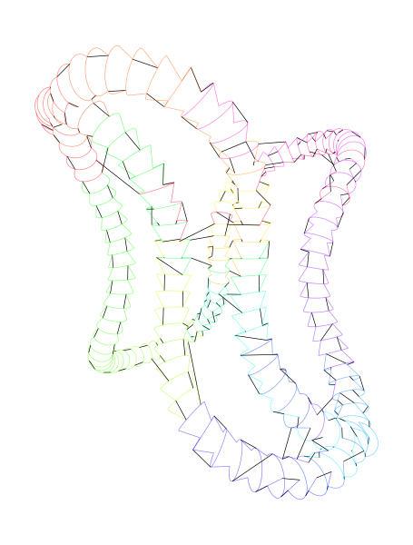

``penkit-optimize`` is a command-line tool for optimizing and visualizing the drawing order of SVG graphics for pen plotting. For more information, `see this post <https://bitaesthetics.com/posts/optimizing-plots-with-a-tsp-solver.html>`_.

Installation
~~~~~~~~~~~~

This package has a non-Python dependency, ``libspatialindex``. The easiest way to install it is by installing the ``rtree`` Python package via Conda::

    conda install rtree

Once this is installed, ``penkit-optimize`` can be installed via ``pip``::

    pip install penkit-optimize

Usage
~~~~~

To see CLI options::

    penkit-optimize -h
        usage: penkit-optimize [-h] [--greedy] [--noopt] [--runtime RUNTIME]
                               [--merge-paths [MERGE_PATHS]] [--vis-output VIS_OUTPUT]
                               input_file [output_file]

        positional arguments:
        input_file
        output_file

        optional arguments:
        -h, --help            show this help message and exit
        --greedy, -g          Run greedy optimization only.
        --noopt, -n           Don't run any optimization.
        --runtime RUNTIME, -t RUNTIME
                              Maximum runtime (in seconds) of optimization stage.
        --merge-paths [MERGE_PATHS], -m [MERGE_PATHS]
                              Merge paths that start/end near each other. You may
                              optionally specify a threshold distance (in document
                              units) after this parameter.
        --vis-output VIS_OUTPUT, -v VIS_OUTPUT
                              If provided, save a visualization of the path to this
                              SVG file.

Examples
~~~~~~~~

Generate optimized SVG with default options (up to 5 minute runtime), and save to ``input-optimized.svg``::

    penkit-optimize input.svg

Don't optimize anything, just visualize the transits::

    penkit-optimize input.svg -n -v noopt-vis.svg

``noopt-vis.svg``:

Run greedy optimization (only), save the file, and save a visualization of the result::

    penkit-optimize input.svg output.svg -g -v greedy-vis.svg

``greedy-vis.svg``:

Run the full optimization and write a visualization of the result::

    penkit-optimize input.svg output.svg -v opt-vis.svg

``opt-vis.svg``:

Run the full optimization and merge paths that start/end within 1.5 units::

    penkit-optimize input.svg -m 1.5